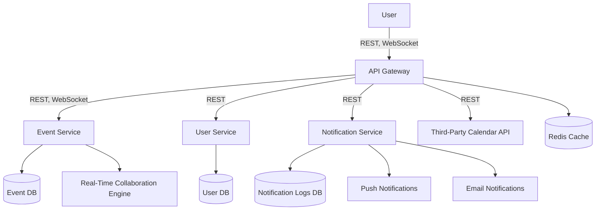

# Real-Time Collaborative Event Planning Platform

This platform enables multiple users to collaborate in real-time to plan and manage events efficiently. With features like shared calendars, task assignments, and live updates, it ensures seamless communication and coordination between all participants. The platform leverages WebSockets for instant collaboration and allows each service (such as user management, event scheduling, and task management) to operate independently, ensuring scalability and smooth user experiences even under heavy loads.

## Assessing Application Suitability for Microservices
### Why Microservices?

Microservices architecture is an ideal choice for real-time, collaborative applications where multiple users need to interact simultaneously while different aspects of the application can be independently scaled. In the case of a real-time collaborative event planning platform, the following advantages make microservices a suitable approach:

1.	Componentization of Event Planning and User Management:
	-	Event creation, updates, task assignment, and user communication can be broken down into individual services. This leads to easier maintenance and development, as each service can be developed, updated, and scaled independently.
2.	Scalability:
	-	Real-time collaboration requires managing a large number of simultaneous users. By using microservices, components like event handling, user authentication, and notifications can scale independently based on demand. This ensures better resource allocation and system responsiveness.
3.	High Availability:
	-	In a distributed system, failures in one service do not necessarily bring down the entire application. If the EventService experiences issues, the UserService and NotificationService will continue to function, ensuring continuous service availability.
4.	Real-Time Communication:
	-	The use of WebSockets or other real-time communication methods is essential for real-time updates in event planning. By isolating the real-time communication (e.g., via the EventService), the rest of the system (e.g., notifications or document storage) can operate asynchronously, leading to a responsive user experience.

## Service Boundaries

1.	Event Service:
	-	Manages the creation and updates of events, including tasks, milestones, and scheduling changes. It handles all real-time updates and communication via WebSockets to ensure users receive instant updates.
2.	User Service:
	-	Manages user authentication, roles, and permissions. It is responsible for user registration, login, and user-specific data such as profiles, preferences, and event participation details.
3.	Notification Service:
	-	Sends notifications to users based on their interactions with the EventService. It can be decoupled from the real-time updates and handle notifications via emails, push notifications, or in-app alerts asynchronously.
4.	API Gateway:
	-	Acts as the entry point for the platform, handling requests from clients and routing them to the appropriate services (EventService, UserService, NotificationService). The gateway also manages WebSocket connections and ensures requests are properly authenticated and authorized.



## Technology Stack and Communication Patterns

1.	Event Service:
	-	Language: Node.js
	-	Framework: Express.js
	-	Communication: WebSocket for real-time updates.
	-	Description: The Event Service will manage event creation, task management, and updates. WebSocket will enable real-time collaboration between users, ensuring they receive immediate updates when changes occur within an event.
2.	User Service:
	-	Language: Python
	-	Framework: Flask
	-	Communication: RESTful API for synchronous communication with the API Gateway.
	-	Description: The User Service will handle user authentication, registration, and profile management. Flask will serve a REST API that the API Gateway will call for all user-related requests, ensuring modular and isolated handling of user-specific functionalities.
3.	Notification Service:
	-	Language: Node.js
	-	Framework: Express.js
	-	Communication: Uses a message queue (e.g., RabbitMQ) for asynchronous communication.
	-	Description: The Notification Service will handle the dispatch of notifications asynchronously using a message queue system like RabbitMQ. This ensures that even when the Event Service is under heavy load, notifications such as emails, SMS, or in-app notifications are still processed and delivered.
4.	API Gateway:
	-	Language: Python
	-	Framework: Flask
	-	Communication: RESTful API and WebSocket handling, routing requests to respective services.
	-	Description: The API Gateway, built with Flask, will handle incoming client requests and route them to the appropriate microservice (EventService, UserService, NotificationService). It will also manage WebSocket connections for real-time event updates, ensuring all communication is properly authenticated and routed.


- Node.js: Used for both the Event Service and Notification Service due to its non-blocking I/O and suitability for real-time, high-concurrency scenarios (WebSockets, message queues).
-	Python: Used for the User Service and API Gateway to handle synchronous API requests and the routing of communication between services.
-	Message Queue (RabbitMQ): Maintains asynchronous communication between services (particularly useful for handling notifications).

## Data Management

1.	Event Service:
	-	Manages events and tasks in a MongoDB database.
	-	Data example: Event details, task lists, real-time updates in JSON format.
2.	User Service:
	-	Manages user data and permissions in a PostgreSQL database.
	-	Data example: User profiles, permissions, and authentication details in JSON format.
3.	Notification Service:
	-	Uses Redis for caching notification status and a MySQL database for long-term storage of notification logs.
	-	Data example: Notification logs, status tracking.


 Data is exchanged between microservices using REST APIs in JSON format. Each service manages its own database, ensuring modularity and scalability.

-  Event Service: Manages event creation, updating, and task assignments.
- User Service: Manages user authentication, registration, and user data.
- Notification Service: Handles sending notifications for upcoming events or important changes.

Each microservice is containerized using Docker, and services communicate with each other through the API Gateway.


## Services and Endpoints

### Event Service

1.	POST /events/create
Create a new event.
- Input:
    
```
    {
  "event_name": "Project Kickoff",
  "date": "2024-10-10",
  "participants": ["user123", "user456"]
}
```

- Output:

```
{
  "event_id": "event789",
  "status": "created"
}
```
2.	POST /events/update
Update an existing event.
-	Input:

```
{
  "event_id": "event789",
  "new_date": "2024-11-11"
}
```

-	Output:
```
{
  "event_id": "event789",
  "status": "updated"
}
```
 
3.	GET /events/list
Retrieve the list of events.
-	Output:

```
[
  {
    "event_id": "event123",
    "event_name": "Team Meeting",
    "date": "2024-09-15"
  },
  {
    "event_id": "event789",
    "event_name": "Project Kickoff",
    "date": "2024-11-11"
  }
]
```
### User Service

1.	POST /user/register
Register a new user.
-	Input:

```
{
  "username": "newuser",
  "password": "securepassword"
}
```


- Output:

```
{
  "user_id": "user789",
  "status": "registered"
}
```

2.	POST /user/login
Log in an existing user.
-	Input:

```
{
  "username": "newuser",
  "password": "securepassword"
}
```


-	Output:
```
{
  "token": "jwt-token"
}
```


### Notification Service

1.	POST /notifications/send
Send a notification to users.
-	Input:

```
{
  "user_id": "user123",
  "message": "Event Reminder: Project Kickoff tomorrow."
}
```

-	Output:
```
{
  "status": "sent",
  "notification_id": "notif789"
}
```


### WebSocket Collaboration

For real-time updates, a WebSocket-based communication system allows users to subscribe to changes in the events they are collaborating on.

-	WebSocket Endpoint: /ws/events
-	Client Message Example:


```
{
  "type": "subscribe",
  "payload": {
    "event_id": "event789"
  }
}
```

- 	Server Update Example:

```
{
  "type": "update",
  "payload": {
    "event_id": "event789",
    "new_data": {
      "status": "completed"
    },
    "timestamp": 1234567890
  }
}
```
## Deployment and Scaling

The platform uses Docker to containerize each microservice, ensuring portability and consistent deployment across environments. The services are managed via Docker Compose, enabling both vertical and horizontal scaling.

1.	Containerization: Each service is containerized using Docker to ensure consistency across different environments.
2.	Orchestration: Kubernetes is used to orchestrate and manage the deployment, scaling, and monitoring of the services.
3.	Scaling: The EventService is expected to be the most heavily used, so it is set up with horizontal scaling using Kubernetes. Each service can scale independently, with EventService replicas dynamically adjusting based on WebSocket connections.


Each service has its own Dockerfile. For example, for the Event Service:

```Dokerfile
# Event Service Dockerfile
FROM node:14
WORKDIR /app
COPY . .
RUN npm install
CMD ["npm", "start"]
```

Example Docker Compose

```
version: '3.8'
services:
  event-service:
    build: ./event-service
    ports:
      - "3001:3001"
  user-service:
    build: ./user-service
    ports:
      - "3002:3002"
  notification-service:
    build: ./notification-service
    ports:
      - "3003:3003"
  redis:
    image: "redis:alpine"
```
## Additional Features

1.	Lobby Mechanism (WebSocket):
	-	The EventService provides a lobby mechanic where users can join an event planning session in real time, collaborating on tasks, updates, and changes through WebSockets.
2.	API Consumption:
	-	The Notification Service consumes a third-party API, such as Twilio, to send SMS notifications to users for critical updates (in addition to in-app notifications).
3.	Service Discovery:
	-	A service discovery mechanism is implemented using Consul to allow services to discover each other dynamically and facilitate load balancing.

## Architecture Diagram

 1.	User Service:
	-	Handles authentication, user management, and user roles.
 2.	Event Service:
	-	Manages event creation, scheduling, task updates, and real-time communication.
3.	Notification Service:
	-	Sends notifications to users through various channels asynchronously.
4.	API Gateway:
	- 	Acts as the front-facing entry point, handling client requests, routing, and WebSocket connections.

## Conclusion

By leveraging microservices for the real-time collaborative event planning platform, the architecture remains scalable, modular, and fault-tolerant. It ensures smooth real-time updates, independent service scaling, and a high degree of reliability.


<hr>

This README provides a comprehensive overview of the Real-Time Collaborative Event Planning Platform, including the services, endpoints, and deployment strategies. Each microservice is self-contained and scalable, ensuring high availability and responsiveness for collaborative users.

Feel free to modify and extend this based on the project’s evolving needs!